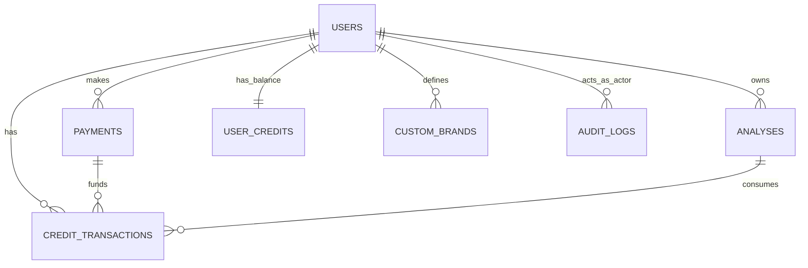

# Модель базы данных VeritasAd

Актуально по состоянию Alembic revision `012` и моделей `backend/app/models/database.py`.

## 1) Логическая модель

Система хранит 4 бизнес-блока данных:

- Пользователи и доступ: `users`, `audit_logs`
- Анализ контента: `analyses`, `custom_brands`
- Платежи и кредиты: `payments`, `user_credits`, `credit_transactions`
- Справочные ограничения: enum-типы (планы, статусы, категории и т.д.)

### Логические сущности и связи

- `User` 1:N `Analysis`
- `User` 1:N `Payment`
- `User` 1:1 `UserCredit`
- `User` 1:N `CreditTransaction`
- `User` 1:N `CustomBrand` (или `CustomBrand.user_id = NULL` для глобального бренда)
- `User` 1:N `AuditLog` (опционально через `actor_user_id`)
- `Payment` 1:N `CreditTransaction` (опционально)
- `Analysis` 1:N `CreditTransaction` (опционально)

## 2) Физическая модель (PostgreSQL-first)

## Таблицы

### `users`
- PK: `id`
- Уникальные поля: `api_key_hash`, `supabase_user_id`, `email`, `telegram_link_token`, `telegram_id` (ORM: unique), nullable
- Основные поля: `plan`, `role`, `daily_limit`, `daily_used`, `total_analyses`, `is_active`, `is_banned`, `metadata`, `created_at`, `updated_at`
- Важно: исторически в миграции `001` есть `user_metadata`, в `011` добавлен `metadata` (legacy-след присутствует в старых БД)

Индексы: `ix_users_id`, `ix_users_api_key_hash`, `ix_users_supabase_user_id`, `ix_users_email`, `ix_users_telegram_id`, `ix_users_telegram_link_token`

### `analyses`
- PK: `id`
- FK: `user_id -> users.id`
- Уникальные: `task_id`, `video_id`
- Основные поля: `source_url`, `source_type`, `duration`, `has_advertising`, `confidence_score`, `visual_score`, `audio_score`, `text_score`, `disclosure_score`, `link_score`, `status`, `progress`, `method`
- JSON-поля: `detected_brands`, `detected_keywords`, `disclosure_markers`, `cta_matches`, `commercial_urls`, `erids`, `promo_codes`
- Текстовые поля: `transcript`, `ad_reason`, `error_message`, `report_path`

Индексы: `ix_analyses_id`, `ix_analyses_task_id`, `ix_analyses_video_id`, `ix_analyses_user_id`, `ix_analyses_status`

### `payments`
- PK: `id`
- FK: `user_id -> users.id`
- Основные поля: `amount`, `currency`, `status`, `provider`, `provider_payment_id`, `metadata`, `created_at`, `updated_at`

Индексы: `ix_payments_id`, `ix_payments_user_id`, `ix_payments_status`

### `user_credits`
- PK: `id`
- FK: `user_id -> users.id` (`ON DELETE CASCADE` в миграции `007`)
- Основные поля: `credits`, `expires_at`, `created_at`, `updated_at`

Индексы: `ix_user_credits_id`, `ix_user_credits_user_id`, `ix_user_credits_created_at`

### `credit_transactions`
- PK: `id`
- FK: `user_id -> users.id` (`ON DELETE CASCADE`), `payment_id -> payments.id` (nullable), `analysis_id -> analyses.id` (nullable)
- Основные поля: `transaction_type`, `credits`, `balance_after`, `package_type`, `description`, `created_at`

Индексы: `ix_credit_transactions_id`, `ix_credit_transactions_user_id`, `ix_credit_transactions_created_at`

### `custom_brands`
- PK: `id`
- FK: `user_id -> users.id` (nullable, `ON DELETE CASCADE`)
- Основные поля: `name`, `category`, `aliases`, `logo_base64`, `logo_url`, `is_active`, `detection_threshold`, `description`, `metadata`, `created_at`, `updated_at`

Индексы: `ix_custom_brands_id`, `ix_custom_brands_user_id`, `ix_custom_brands_name`, `ix_custom_brands_is_active`, `ix_custom_brands_created_at`

### `audit_logs`
- PK: `id`
- FK: `actor_user_id -> users.id` (nullable)
- Основные поля: `event_type`, `event_category`, `description`, `actor_email`, `actor_ip`, `target_type`, `target_id`, `changes`, `metadata`, `status`, `error_message`, `created_at`

Индексы:
- `ix_audit_logs_id`, `ix_audit_logs_event_type`, `ix_audit_logs_event_category`, `ix_audit_logs_actor_user_id`, `ix_audit_logs_actor_email`, `ix_audit_logs_status`, `ix_audit_logs_created_at`
- Составные: `idx_audit_logs_actor_created`, `idx_audit_logs_event_type_created`, `idx_audit_logs_target`

## Enum-типы (PostgreSQL)

- `user_plan`: `free`, `starter`, `pro`, `business`, `enterprise`
- `user_role`: `user`, `admin`
- `source_type`: `file`, `url`, `youtube`, `telegram`, `instagram`, `tiktok`, `vk`
- `analysis_status`: `pending`, `queued`, `processing`, `completed`, `failed`
- `payment_status`: `pending`, `succeeded`, `canceled`, `failed`
- `payment_provider`: `yookassa`
- `brand_category`: `bank`, `telecom`, `auto`, `food`, `beverage`, `clothing`, `technology`, `marketplace`, `bookmaker`, `energy`, `airline`, `retail`, `pharma`, `cosmetics`, `gaming`, `education`, `other`
- `audit_event_type`: события аутентификации, админ-действий, data/security/system событий (см. migration `005`)

## Примечания по средам

- Прод: PostgreSQL (native enum-типы и JSON)
- Локальная разработка: SQLite (enum деградируют в `String`, есть локальный sync столбцов `analyses` в `init_db()` для dev-баз)
